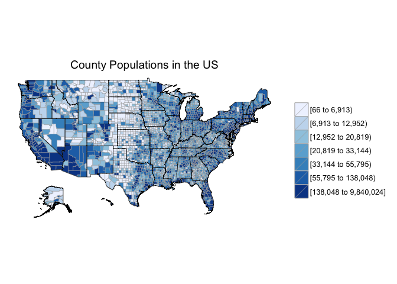
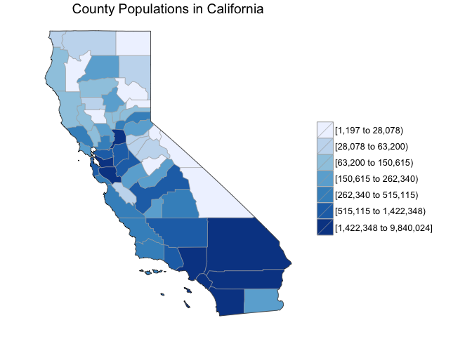
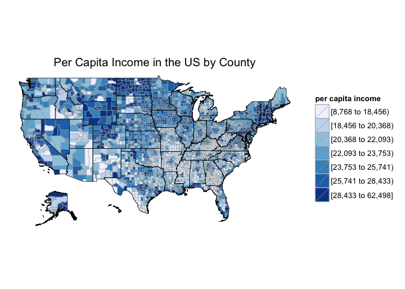
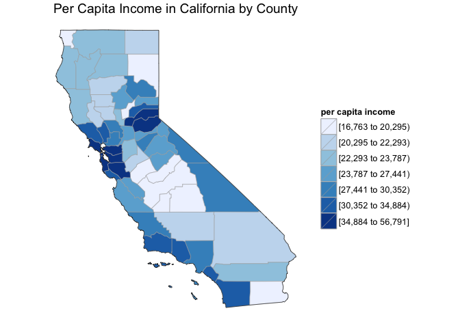
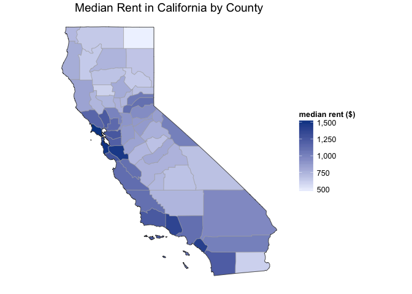
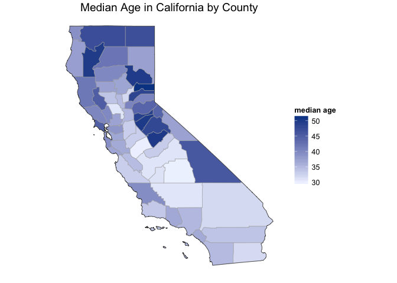
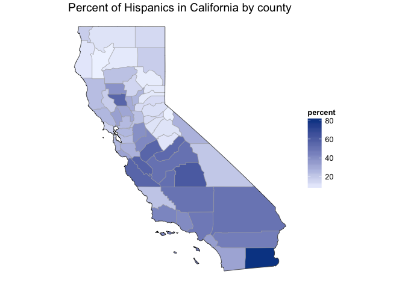
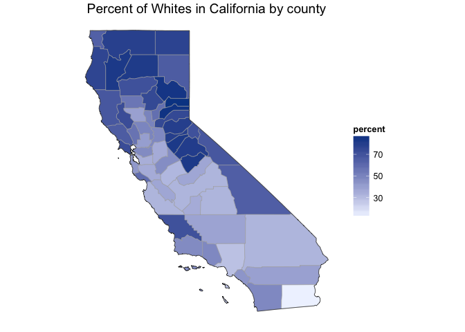
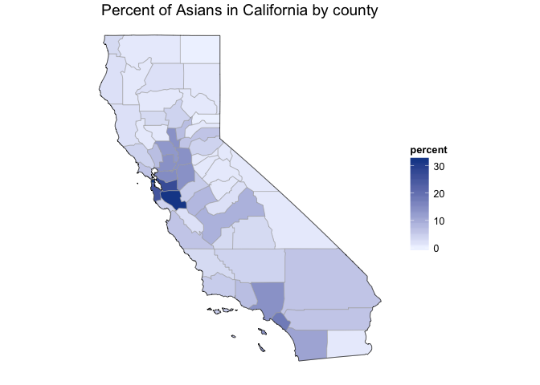

# Mapping County Demographics in the US for 2012
David Clark  
October 11, 2015  

Load the libraries:


```r
library(choroplethr)
library(choroplethrMaps)
```

Inspect county data:


```r
data("df_pop_county")
head(df_pop_county)
```

```
##   region  value
## 1   1001  54590
## 2   1003 183226
## 3   1005  27469
## 4   1007  22769
## 5   1009  57466
## 6   1011  10779
```

Map county populations in the US:


```r
county_choropleth(df_pop_county, title = "County Populations in the US")
```

 

Map county populations in California:


```r
county_choropleth(df_pop_county, title = "County Populations in California", state_zoom = "california")
```

 

Inspect county demographic data:


```r
data("df_county_demographics")
colnames(df_county_demographics)
```

```
## [1] "region"            "total_population"  "percent_white"    
## [4] "percent_black"     "percent_asian"     "percent_hispanic" 
## [7] "per_capita_income" "median_rent"       "median_age"
```

Select per capita income:


```r
df_county_demographics$value = df_county_demographics$per_capita_income
```

Map of per capita income in the US by county:


```r
county_choropleth(df_county_demographics, title = "Per Capita Income in the US by County", legend = "per capita income")
```

 

Map of per capita income in California by county:


```r
county_choropleth(df_county_demographics, title = "Per Capita Income in California by County", legend = "per capita income", state_zoom = "california")
```

 

Map of median rent in California by county:


```r
df_county_demographics$value = df_county_demographics$median_rent
county_choropleth(df_county_demographics, title = "Median Rent in California by County", legend = "median rent ($)", state_zoom = "california", num_colors = 1)
```

 

Map of median age in California by county:


```r
df_county_demographics$value = df_county_demographics$median_age
county_choropleth(df_county_demographics, title = "Median Age in California by County", legend = "median age", state_zoom = "california", num_colors = 1)
```

 

Map of percent **hispanic** population in California by county:


```r
df_county_demographics$value = df_county_demographics$percent_hispanic
county_choropleth(df_county_demographics, title = "Percent of Hispanics in California by county", legend = "percent", state_zoom = "california", num_colors = 1)
```

 

Map of percent **white** population in California by county:


```r
df_county_demographics$value = df_county_demographics$percent_white
county_choropleth(df_county_demographics, title = "Percent of Whites in California by county", legend = "percent", state_zoom = "california", num_colors = 1)
```

 

Map of percent **asian** population in California by county:


```r
df_county_demographics$value = df_county_demographics$percent_asian
county_choropleth(df_county_demographics, title = "Percent of Asians in California by county", legend = "percent", state_zoom = "california", num_colors = 1)
```

 
